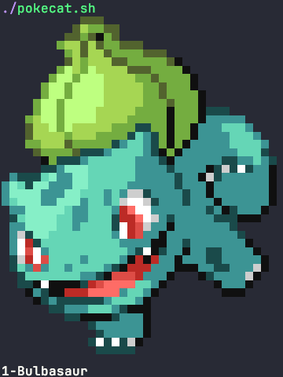
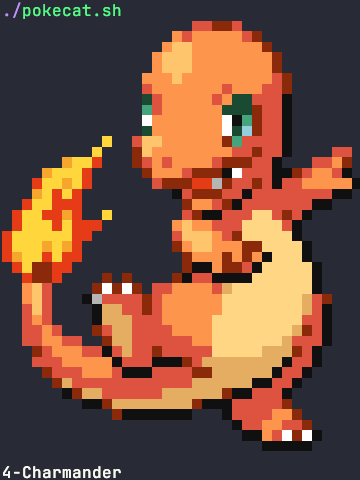
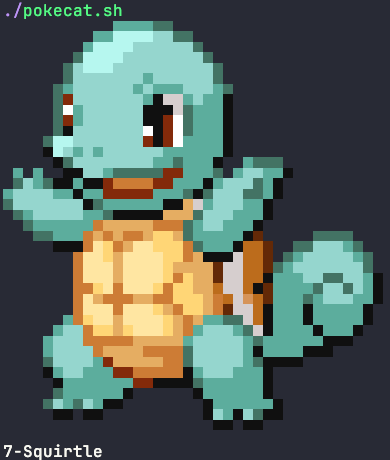

# pokecat

## Description

pokecat is a utility that prints random pokemon (up to Generation IV) to the terminal using unicode block characters. It is meant to be added to your shell's initialization script so that a new pokemon is printed in each new shell session. It is written in Bash, with a focus on robustness, readability and extensibility. Indeed you are encouraged to look at the code yourself and adapt it to your needs and preferences!

## Examples

## Installation

1)
    Clone the repository

        git clone https://github.com/gvlassis/pokecat.git

2) 
    Install dependencies. There are two set of dependencies, the dependencies for make_res.sh (which creates the ./res folder) and the dependencies for pokecat.sh (which is the main program). The dependencies for make_res.sh are: svn, curl, jq and mogrify (ImageMagick). pokecat.sh has only one dependency: [catimg](https://github.com/posva/catimg). Note that, **for convenience purposes, the ./res folder that is created by make_res.sh is already in the repository. Thus, to run pokecat.sh you only need the second set of dependencies (catimg)**.
    For example, on macOS using Homebrew:

        brew install catimg

    , or on Ubuntu:

        apt install catimg

3) 
    cd to the cloned repository and run make_res.sh and/or pokecat.sh. Note that both scripts output helpful error messages in case of problems.

        cd pokecat
        ./pokecat.sh

4) 
    You can create a link of your choice (e.g. pokecat, pcat, pk) and add it to a directory that is in your PATH. For example, assuming the repository was cloned under ~/.local/share and that ~/.local/bin is in your PATH:

        ln -sf "${HOME}/.local/share/pokecat/pokecat.sh" "${HOME}/.local/bin/pcat"
        pcat

    Another good idea might be to **call pokecat.sh in your shell's initialization script** (e.g. .bashrc, .zshrc). For example, for Bash:

        printf "${HOME}/.local/share/pokecat/pokecat.sh\n" >> "${HOME}/.bashrc"
